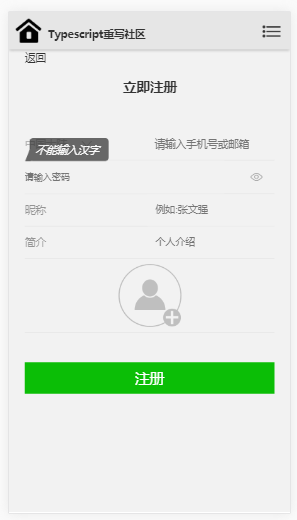

#
# 前后端分离项目之搭建多人博客

使用AngularJs1.x+Typescript+Express+MongoDB开发前后端分离项目

## 技术栈选择

前端

* AngularJs1.x\(目前最高版本1.6\)

* Typescript\(es6的超集\)

后端

* Nodejs: 'v8.2.1'

* MongoDB: '3.4.4'

* Express: '4.15.0'

## 为什么要前后端分离

前后端各司其职 专注领域

Web2.0的热潮 , Ajax的兴起带来SPA时代 \(Single Page Application单页应用\) ，前后端可以通过Json（可选协议之一）来交流，独立性更强,前后端人员在商量好接口后就可以'分手了'，通过语义良好的Restful API连接前后端人员的交流，见名知意

#### 如何启动demo

项目搭建由AngularJs1.6+Typescript+Express4.x构成

第一步，clone项目源码

```
git clone git@github.com:MrZwqShuai/Micro-agency-Demo.git
```

第二步，安装依赖

```
cd Micro-agency-Demo
npm install
```

第三步，测试demo
1. 在启动项目之前你必须要配置本地的mongodb数据库才可以访问，[Windows用户下载地址](https://www.mongodb.com/download-center#community)

```
supervisor app
```
2. 或者第二种方法，线上数据库，我申请了一个线上的数据库[MLab](https://mlab.com)，你可以直接输入
```
NODE_ENV=production supervisor app
```
来启动demo

第四步，打开浏览器访问下面地址
> localhost:3000

#### 项目需要掌握的AngularJs请跳转
https://mrzwqshuai.gitbooks.io/-ws/content/

我们的页面大概会是下面这个样子





